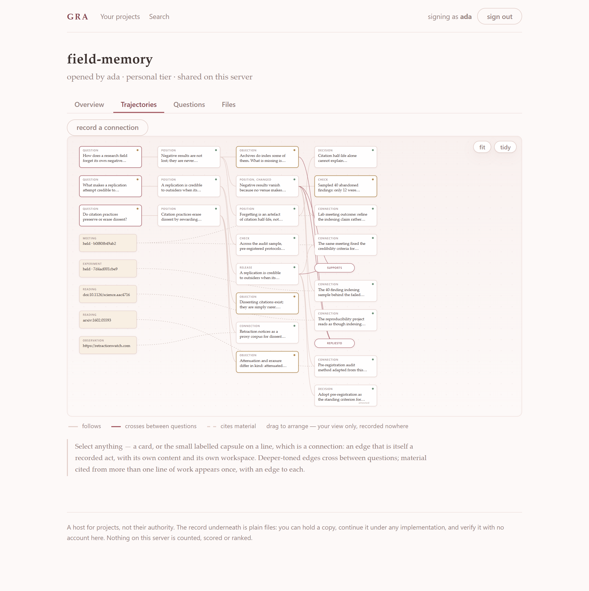
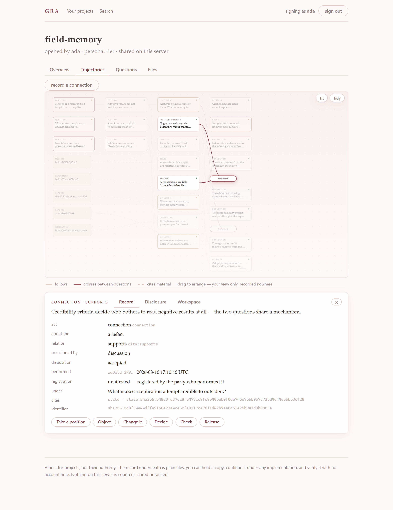
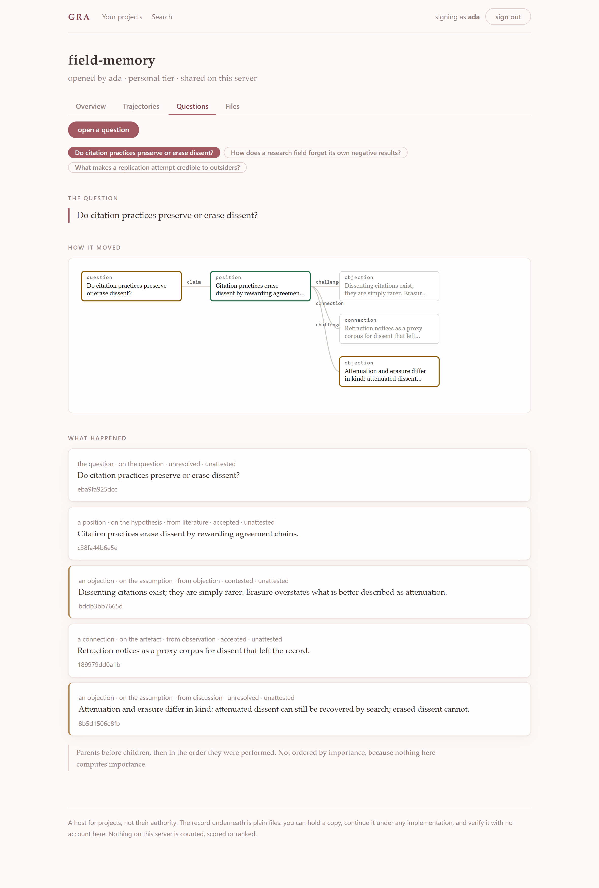
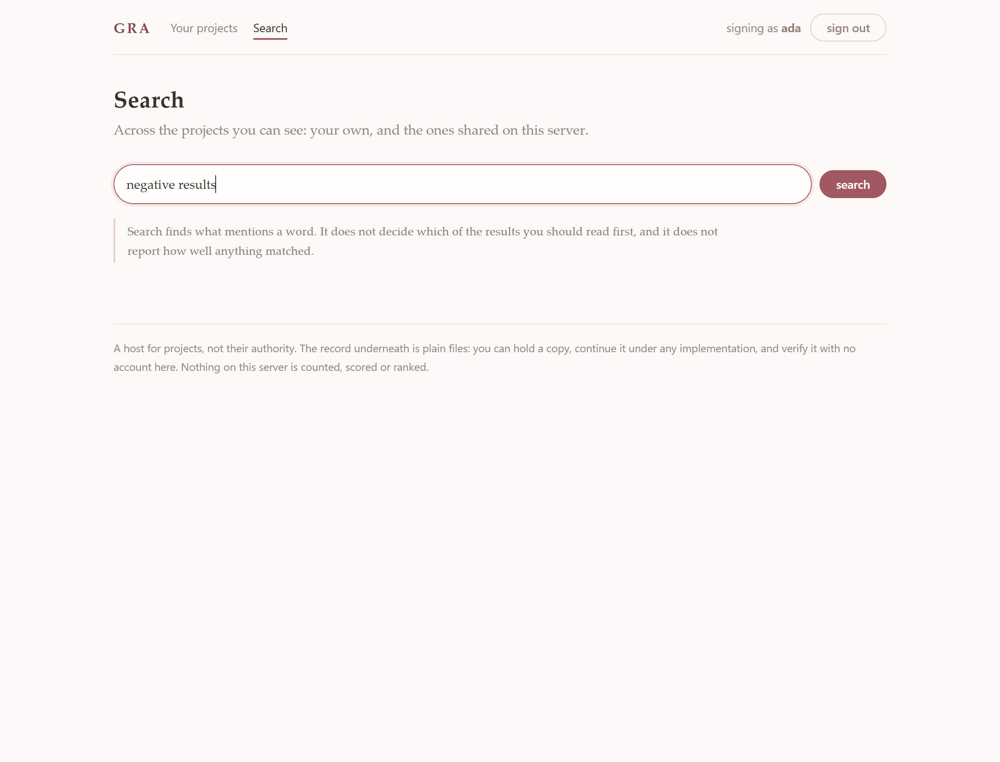
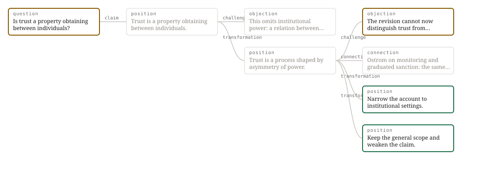

> [!IMPORTANT]
>
> ### Building the next open infrastructure for generative academia
>
> Recent changes across the open-science infrastructure landscape have again highlighted how difficult it is to sustain open scholarly spaces over the long term.
>
> Knowledge and academia develop through continuous co-evolution, propagation, discussion, revision, and co-creation within a commons. Research projects are living generative processes: ideas emerge, relations form, evidence changes understanding, discussions redirect trajectories, and new knowledge creates conditions for further knowledge.
>
> This is one of the motivations behind **Generative Relational Academia (GRA)**.
>
> GRA aims to develop an open academic protocol and infrastructure supporting familiar scholarly functions such as research project management, publication, persistent identification and DOI integration, while placing particular emphasis on the **generativity and evolving trajectory of research itself**. We are exploring how research processes, epistemic transitions, provenance, collaboration, discussion, AI participation, and relations among scholarly objects can become visible, interoperable, reconstructable, and capable of continuing across platforms.
>
> This is currently an independently initiated open project. We welcome researchers, developers, librarians, open-science communities, universities, research infrastructures, and anyone interested in the future of scholarly communication to discuss, experiment, contribute, or explore possible cooperation with us.
>
> **If you are interested in co-creating this infrastructure,**
> please feel free to contact us or contribute directly to this repository:
>
> **Wanhong HUANG**
> Serendip Commons Society
> [huangwanhong@serendip.ngo](mailto:huangwanhong@serendip.ngo)


# Generative Relational Academia (GRA)

**Infrastructure for recording how understanding changes.**

Scholarly communication transmits finished artefacts and discards the *trajectory* that produced them —
which assumption was abandoned, which objection forced the abandonment, which approach was tried for six
months and set aside, which direction was chosen over which alternative and on what ground. GRA is a
protocol, and a reference tool, for keeping that record.

**Stage 0 — design and standardisation.** Four papers are drafted and the protocol is specified as
**GRRP v0.1**, which has **no deployment history and no evidence of use** — every requirement in it is
a proposal about what such use would need. The reference tool [`grrp`](grrp/) implements the
protocol through the **open tier**, and **all eight acceptance tests pass**. It has not yet been used
on real work.

The protocol now exists **twice**: in Python ([`grrp/`](grrp/)) and in TypeScript
([`web/packages/protocol`](web/packages/protocol)), agreeing byte-for-byte on 35 shared vectors. A
protocol nobody has implemented twice is a protocol whose specification has not been tested — and
that suite found a real one on its first run, where the two languages stripped different sets of
trailing whitespace and produced two different identifiers for the same document.

A hosted interface is being built in [`web/`](web/): **a host for projects, which is not their
authority.** It stores no private key, computes no quantity over anyone, and can be deleted without
costing anybody a record.

---

## Gallery

Everything below is real output from a real record — the philosophy case from the specification.
Nothing here is a mock-up. The screenshots are taken from a running server by
[web/tools/gallery.mjs](web/tools/gallery.mjs); the drawings are emitted by the tool itself. The
command that produced each one is named.

### The front page, signed out

Reading what people have shared, and searching it, needs no account. An account is access to one
host, not permission to look — and a front door that showed nothing until you signed in would have
already decided it was the authority.


### A project, as one graph

Every question in a project, in one picture — the demonstration record `field-memory`, which
carries every node and edge kind the [graph model](plans/spec-graph-model.md) names. The deeper
rose edge **crosses between questions**; the labelled capsule on a line is a **connection: a
reified edge**, drawn as an edge and openable as a node, because it is one. Nodes drag; the view
pans and zooms; positions are your view only, recorded nowhere.

Left to right is distance from a question, not importance. Nothing is ranked, sized or coloured by
how much it matters, and no line is marked the principal one.



### One subject, in full — including an edge

Selecting anything lights what it touches and lets the rest recede. Here the selected subject is a
**connection** — the reified SUPPORTS edge between two questions — opened as a node beneath the
drawing with its record panel (the signed payload, the CiTO binding, registration, the full
identifier), its disclosure panel, and **its own workspace**. The acts row records against it
through `grrp`, whose refusals are shown verbatim.



### What happened, under one question



### Search, which filters and does not rank

No relevance ordering, no best match, no score. Matches come back in the same order everything else
is listed in, and the API says so in its own payload so that a second client cannot present them as
ranked without contradicting it.



### The trajectory, drawn by the tool itself



```bash
grrp graph -o trajectory.svg
```

One column per step away from the question. Edges are labelled by the act that made them. The two
positions on the right **diverged, and are drawn identically** — nothing in the picture designates a
principal line, because nothing in the record does. In inquiry a fork is frequently the correct
outcome, so plurality is the normal shape of a healthy record rather than an unfinished one.

The objection in amber is `unresolved` and has never been answered. It stays there.

### Where the work stands

```console
$ grrp show
trust   (trust)
  question   Is trust a property obtaining between individuals?

  live positions
    960f13b89624  Narrow the account to institutional settings.
    9168b1900d17  Keep the general scope and weaken the claim.
    these diverged. Neither is the canonical one.

  unanswered
    a670a1a0d460  question    Is trust a property obtaining between individuals?
    68985dd9b7cb  challenge   The revision cannot now distinguish trust from complian…

  unattested throughout - useful to you, evidence to nobody
```

Derived from the log, never stored. The last line is the honest one: **a record you registered
yourself is useful to you and is evidence to nobody.**

### What you still owe an answer to

```console
$ grrp open
trust - trust
  a670a1a0d460  question     2026-08-07T11:48:32Z
      Is trust a property obtaining between individuals?
  68985dd9b7cb  challenge    2026-08-07T11:48:34Z
      The revision cannot now distinguish trust from compliance.
      against b9493578195b
```

This is also **the entry path**. Each item is an identified state that someone holding no prior
standing in your work can reference in a challenge, a connection or a verification — and be judged on
the act itself, not on who they are.

### What a ground leaves disclosable

```console
$ grrp disclose 616bb79843 --class private --ground appropriability
disclosed 616bb79843a1  at private
  ground   appropriability - the content whose disclosure would destroy that excludability

  What this ground leaves disclosable, and what you must still disclose:
    appropriability: the existence of the work, the questions pursued, the decisions
    taken and their reasons, and negative results

  Misapplied, this is: rent-seeking secrecy - secrecy obtained on an economic
  justification that does not apply.
```

The residue is surfaced at the moment of withholding, because it is the **one question a reader can
always ask**: was what the ground leaves disclosable in fact disclosed? A declaration accompanied by
its residue costs the declaring party something; one without it costs nothing.

### What it refuses

The most characteristic thing about the tool is what it will not do.

```console
$ grrp register 3bd6fc72e6
[C2] you cannot register your own act. Credibility follows from the distribution of
registrations across parties who did not coordinate, and follows from no property of
the record itself.

$ grrp disclose 687087cf --class private --ground hazard
[C7] disclosure may widen and never narrow. 687087cf329f is at 'public'; 'private'
is narrower. A party who has read a record retains what they read, so an operation
offering the appearance of withdrawal would misdescribe to your own participants a
state of affairs obtaining outside this record.

$ grrp disclose 616bb79843 --release-at 2030-01-01
refused: a schedule may be shortened, never extended (2027-06-01).
  Recording the attempt, because it should be visible that it was made.
[C7] a delay that can be extended indefinitely is a permanent withholding made to
look temporary.
```

Each refusal names the constraint and says what to do instead, because a protocol that refuses things
without saying why reads as a bug.

### The document it emits

```bash
grrp release && grrp export <release> -o paper.md
```

[docs/gallery/release.md](docs/gallery/release.md) — the released state, **the chain of transitions
that produced it**, the parties with their CRediT roles, the content absorbed from elsewhere with its
attribution, and the objections standing unresolved at the moment of release. Assembled from records
made in the course of the work, with no additional writing.

That last section is the one no other process can produce, and the reason adoption does not require
anyone to stop publishing.

### The local page, and the hosted one

```bash
grrp ui                       # single user, loopback, no account, no network
cd web && npm run dev         # a host: accounts, projects shared between them
```

Both are **Level 3 — an application over the record, outside conformance**: everything they offer is
available from the command line, no module of the record imports them, and a test asserts that a
record written from a page and one written from the terminal are the same record.

The hosted one stores **public keys only**. It has no column a private key could go in, which is what
makes an attestation registered there worth anything: a host holding both parties' keys could forge
one, and C2 would be bookkeeping rather than evidence. Deleting its whole database costs a reindex
and nothing else — [a test asserts that](web/packages/server/test/authority.test.ts) by deleting it
and checking every record returns identical from the files.

---

## The argument in four steps

**1. The artefact is weakening as evidence.**
A published artefact conveyed information about its producer's capacity *only because producing it was
costly in a way that discriminated between producers*. The evidence was never in the object — it was in
the difference between what the object cost different producers. Where that cost falls for producers of
every capacity at once, the discrimination goes while the artefact, the practice, and the systems reading
it all remain in place. **The failure is invisible from inside the practice**, because the artefacts
continue to arrive and continue to be counted.

**2. So the trajectory becomes a candidate — but it inherits the same problem.**
Two hundred entries describing questions, attempts, failures and revisions, internally consistent and
plausibly paced, are an *easier* object to fabricate than the paper they purport to have produced.
Length, detail and the appearance of struggle are properties a fabricated record has as readily as a true
one. **Preserving a research process establishes nothing on its own.**

**3. Therefore credibility must come from distribution, not from content.**
A transition registered by **a party distinct from the one who proposed it** is costly to fabricate in
proportion to the number of parties who would have to participate in the fabrication. The precedent is
old: the bound, paginated laboratory notebook countersigned by a witness who was not the inventor —
evidential *without* disclosing its contents to anyone.
This is why GRA is a **protocol and not a platform**: a platform operator is party to every entry and
cannot supply the independence the record's credibility depends on.

**4. And the binding constraint is capture cost, not representation.**
Systems adequate to represent issues, positions, objections, options, claims and evidence have existed
since 1970 — IBIS, gIBIS, Compendium, design-rationale notations, scholarly claim ontologies — built by
capable people with funding, connected to deployed standards. **They were not adopted.** The documented
cause is that the work of recording fell on the party who gained least from the record, at the moment
they could least bear it, in a form that served a different party later.

> **The first constraint on the design follows:**
> **every act the protocol defines is one a participant performs for a reason of their own, with the
> record falling out of its performance.** An act that exists *so that a record should exist* will not be
> performed, and any part of the design depending on such an act is moved to an optional tier or removed.

---

## What is recorded

The unit is **not** a document, a comment, or an output. It is a **transition**: an identified prior state
became an identified posterior state, through a typed act performed by a party and registered by a party.

```
state s_k  ──[ act: challenge · target: assumption · relation: modifies ]──▶  state s_k+1
                performer: A          registrar: B (distinct, signed)
                disposition: unresolved
```

A **trajectory** is the directed graph of these. **The "current state" is computed from the graph and
never stored as an authority.**

This is what no existing system records. Platforms that decompose a publication into typed linked units
show that a second hypothesis exists; they do not show that *this objection converted the first hypothesis
into it*. Commentary systems attach a remark to an artefact — nothing transitions, no state is superseded,
and the relation between the comment and any later change lives only in the author's memory.

### Transitions are typed along five independent dimensions

Not one flat list of several dozen tags. Agreement between people classifying the same event declines as
the number of categories rises, and a vocabulary requiring deliberation re-introduces the capture cost the
whole design exists to avoid.

| Dimension | Values | Extensible? |
|---|---|---|
| **act** | `question` `claim` `challenge` `transformation` `decision` `connection` `verification` `release` | fixed by the protocol |
| **target** | question · assumption · hypothesis · concept · theory · method · path · artefact | by charter |
| **relation** | extends · modifies · replaces · refines · generalises · specialises · transfers | bound to **CiTO** |
| **trigger** | reflection · literature · experiment · simulation · observation · discussion · objection · failure · automated suggestion · **entry of a new party** | by charter |
| **disposition** | `accepted` · `contested` · **`unresolved`** | fixed by the protocol |

**`unresolved` is not optional.** Most objections in theoretical work are never resolved: they stand, and
the work proceeds beside them. A vocabulary recording only acceptance and rejection would produce a
systematically false record of the fields this project most concerns — and would exert pressure toward
**fabricated closure**.

*Contribution is not an act.* It types a party's part **in** an act, and binds to **CRediT**.

### Three planes

```
Applications          search · matching · summarisation · visualisation · assessment of content
                      ── outside conformance. The protocol requires none of it. ──
        ▲
   TRANSITION PLANE   typed transitions · parent links · attestation + signature · attribution and
                      absorption links · disposition · disclosure class + declared ground
                      APPEND-ONLY. The system of record.
        ▲  registration by a responsible party promotes an event to a transition
   EVENT PLANE        auto-generated records that something occurred: meetings, comments, file
                      changes, permission changes, model operations.
                      PRIVATE TO PARTICIPANTS. Never exported, never indexed.
        ▼  delegation
   Substrates         version control · repositories and persistent identifiers · federation protocols
                      ── existing, maintained by others, not reimplemented here ──
```

The event plane is cheap to populate and carries **no epistemic claim**. It is also where the
surveillance hazard falls: a complete log of who attended and whose files changed is a monitoring record
by construction. It is confined to participants and reaches wider disclosure **only through a transition
that references it**.

**GRA contributes the transition plane and the rules governing promotion into it — and nothing else.**
Storage, identifiers, append-only history, content addressing, archival deposit and transport all exist,
are maintained by parties with the resources to keep maintaining them, and are delegated.

---

## Withholding

An arrangement that records how understanding changes **must** be able to withhold. The question is never
*whether* but **on what ground — and what follows from the ground**.

Nothing here confers a right to exclude. Withholding is justified **by a reason, never by a title**, and
the reason does work: it determines what is withheld *and what must still be disclosed*.

| Ground | Condition | What it restricts | **Residue — must still be disclosed** |
|---|---|---|---|
| **rivalry** | a resource admits limited simultaneous use | **access to the resource** | **the trajectory in full** |
| **hazard** | propagation of the content creates risk | the propagable content of a method | existence, questions, decisions, interpretations, non-conveying results |
| **exploratory vulnerability** | exposure now would suppress or distort the work | **the timing of exposure** | **everything, at the scheduled time** |
| **appropriability** | funding requires excludability | content whose disclosure destroys excludability | existence, questions, decisions, **negative results** |

**The residue rule is the operative rule of the whole design.** Without it, every ground collapses into
the same thing — silence with a justification attached. With it, a restriction becomes a **dated,
attributable assertion**, and a reader has one checkable question: *was what the ground leaves disclosable
in fact disclosed?*

That question is the only observable available in every case. **A declaration accompanied by its residue
costs the declaring party something; a declaration withholding it costs nothing — and the second is the
signature of misapplication.**

Three further rules:

- **Disclosure is monotone.** It may widen and must not narrow. **There is no `unpublish` operation** — a
  party who has read a record retains what they read, and an arrangement offering the appearance of
  withdrawal misdescribes to its own participants a state of affairs obtaining outside it. A scheduled
  release may be **shortened, never extended**.
- **Restriction is per record**, never per repository or per project. A single line of work carries states
  disclosed to everyone, to a group, and to nobody, with the differences declared and grounded.
- **Content is separable from the attested skeleton**, so **redaction removes content while leaving the
  graph and the signature chain intact** — and the record of the redaction itself is never removed.

The design cannot separate the valuable from the dangerous within a trajectory, **because they are the
same material** — so it separates the *parties to whom it is disclosed* rather than filtering the content.

---

## How it is adopted, if it is

The design assumes it will be used first by **one researcher, alone, with no collaborators**. If the tool
is not worth using by a single person on the first day, nothing that follows happens.

| Tier | Adds | What its adopter gets |
|---|---|---|
| **Personal** | transitions with parent links against identified prior states · append-only log with derived views · three acts (`claim`, `challenge`, `release`) · content separable from skeleton | a searchable record of what was ruled out **and why** · a standing list of objections not yet answered · **a citable release with its chain** |
| **Group** | attestation by a distinct party · CRediT roles · absorption links · disclosure classes with declared grounds · administrative operations recorded | **evidence** — credibility begins where a second party registers · visible attribution of changes · onboarding a new member from the record |
| **Open** | propagation with declared profile · distributed custody · archival deposit of released material · charter reference · operator-independent identifier resolution | exchange with parties elsewhere · continuation of the record beyond any operator · entry of strangers through the open register |

**The personal tier delivers utility and no evidential weight, and the two must not be confused.** Every
transition in a self-registered trajectory is marked **unattested**, and stays marked on export.

Two things make the tiers matter economically. **Each tier must return something at its own scale**, so
no party is ever asked to act on a benefit that requires others. And the **minimum viable adopting unit**
is small: two parties who register each other's transitions at the group tier; one community with an
implementation and a charter at the open tier. A design whose minimum unit was a discipline would need an
agreement nobody can broker. This one needs a decision two people can take on a Tuesday.

**A release emits a citable document** — the released state, the chain of transitions leading to it, the
parties with their roles, the absorption links with their attributions, and **the objections standing
unresolved at the moment of release** — assembled from records created in the course of the work, with no
additional effort. Nothing here asks anyone to stop publishing.

### The entry path

A trajectory holds states whose disposition is `unresolved`: obstacles met, objections standing, questions
raised without answers. That set, published at each disclosure class, is a **register of open problems**,
and any party holding **no prior position at all** may reference one in a `challenge`, a `connection` or a
`verification` — decided on the act itself.

This matters because the usual qualifications fail. *Demonstrated contribution* requires access in order
to be satisfied and grants access in return for satisfaction; *trust extended by existing participants*
has the same shape with an extra step. Both are closed against every party who holds no prior position —
which reproduces, at the scale of a working group, exactly the exclusion the project diagnoses at large
scale.

---

## What this project does not claim

The papers spend a substantial part of their length forbidding specific claims. They are repeated here
because they are the ones most likely to creep back into a description of the work.

- **It does not reduce competition or democratise recognition.** Standing is a *positional* good: the
  aggregate available in a field is fixed by construction. Making more contributions visible
  **redistributes** recognition; it does not create it. What may be claimed is that it **changes what
  competition rewards** — and that attribution mechanisms will therefore be *resisted* by parties who
  benefit from the present invisibility of others' contributions.
- **It does not produce serendipitous encounters.** There is no evidence that infrastructure increases
  productive unplanned encounter, and the strongest qualitative study of an arrangement designed to
  produce it reports occupants developing strategies to *avoid* it. What may be claimed is a lowered
  **cost of preparation**: a recorded, available state is preparation externalised, so that another
  party's preparation may meet it.
- **It does not measure capacity.** Two trajectories may coincide entirely in their recorded appearance
  while differing entirely in the generativity of the relations that produced them. **The record holds
  what occurred, not what the relation was capable of.**
- **It does not make another party's work continuable from where they stopped.** A record carries only the
  *articulable fraction* of what its participants held; the rest transmits, if at all, by working alongside
  them. What transfers is **the redirection of attention** — that an approach was attempted, on what
  assumption, and what obstruction was met.
- **It computes no scores.** No quantity over participants or over trajectories, and no total order over
  either. Not transition counts, not attestation depth, not contribution shares, not "trajectory health".
  This costs the arrangement the ability to report that a project is going well or to rank contributors
  for a committee, and the cost is real and accepted. *(Counts **within** one trajectory, shown without
  comparison across trajectories or participants, are permitted.)*
- **It requires no AI.** Every conformant operation is performable with a text editor and a version-control
  system. A model may *propose* a transition and may **not author or register one**, and a
  model-originated proposal is marked as such.
- **It has no merge.** Two revisions of a concept do not compose, no conflict region localises, and no
  test decides the result. Integration appears only as a **synthesis** (a state referencing several
  parents) or an **absorption** (content taken from elsewhere, with attribution to its originator). **In
  inquiry a fork is frequently the correct outcome, and plurality is the normal shape of a healthy
  record.**

---

## What is known to be unsolved

These are stated as open, not as oversights. A difficulty counts as *addressed* only where there is a
mechanism, an identified party who bears its cost, and a stated condition under which the mechanism fails.
Four fail that test:

- **Assessment capacity.** Every mechanism lowers the cost of contributing and lowers the cost of assessing
  by nothing, so congestion follows *from the design working*. The usual remedy — ranking — is excluded.
  The remaining options (reciprocal obligation, bounded intake, maintainer triage) are all charter matters
  and all place an unfunded burden on a few parties. **This is the difficulty most likely to determine
  whether a conforming arrangement survives at scale.**
- **Maintainer labour.** Unfunded, concentrating on few parties, growing with adoption, with no party whose
  interest is proportional to the benefit. The open-source record is a warning here, not an encouragement.
- **The regressive incidence of overhead.** Recording falls hardest on those with the least time and the
  least standing — the population the diagnosis concerns. The byproduct principle addresses the *magnitude*
  and the *timing* of that cost, and not its *distribution*.
- **Recognition of attributed contribution.** No property of a protocol makes a community count what it
  records.

And two the papers name as structurally beyond the four grounds: **downstream reuse** of trajectory records
by parties who did not produce them (the design's own criterion marks uncompensated corpus assembly as
*extractive*, and supplies no mechanism against it), and **hazard restrictions**, which admit no scheduled
release and so commit a community to maintaining a class indefinitely.

---

## How this project would be shown to have failed

Stated in advance, so they can be looked for:

1. **Personal-tier adoption without progression to the group tier**, over a substantial population and
   period — the arrangement would have delivered private utility without the attested records on which
   every evidential claim rests, and become **a note-taking convention**.
2. **Records in which the `decision` act is rare while transformations are common** — the act on which the
   reuse of abandoned work depends is not being performed, and making it cheap was insufficient.
3. **Group-tier declarations alongside registration patterns of pairs who register only each other** —
   attestation operating as a formality.
4. **A widely used external score computed over conformant records** — the exclusion of scalar measures
   displacing the dynamic rather than preventing it.

Beyond the specification, the whole account is withdrawn on any of: a deployed system or published
specification already taking the transition between identified states as its unit with registration by a
distinct party; a specification already defining admissible acts and their effect on a shared state for
scholarly work, with conformance conditions; evidence that the rationale-capture systems failed for
reasons **other than capture cost**; or evidence that the artefact's separating condition has **not**
weakened.

---

## Repository

```
papers/   the four working drafts (CC BY-NC 4.0)
notes/    dense working notes on each paper, a glossary, and a gap analysis  ← start here
plans/    implementation-plan.md — the single build plan, as a checklist
          design-nodes-time-and-occasions.md — decisions taken before building
grrp/     the reference implementation, Python — the protocol is defined against it
web/      the hosted interface, TypeScript
            packages/protocol   GRRP again, in TypeScript. Browser and server.
            packages/server     Fastify + SQLite. Owns no protocol decisions.
            packages/client     React. Disposable by design.
docs/     the gallery above
```

### The papers

| | |
|---|---|
| **I** · [Designing Generative Relational Academic Infrastructure](papers/GRA-paper-I-Designing-Generative-Relational-Academic-Infrastructure.pdf) | The problem, the prior art conceded in full, and **sixteen requirements** derived from it. |
| **II** · [Incentives, Collective Action, and Adoption](papers/GRA-paper-II-Incentives-Collective-Action-and-Adoption.pdf) | Whether any of this happens. Where the commons dilemma actually sits, the positional bound, **the absorption test**, and ten predictions with their refutations. |
| **III** · [Grounds of Restriction](papers/GRA-paper-III-Grounds-of-Restriction.pdf) | Disclosure governance: four irreducible grounds, each with an object, a residue, and a named failure. |
| **IV** · [Specifying the GRRP](papers/GRA-paper-IV-Specifying-the-GRRP.pdf) | **The normative specification, v0.1** — record model, act vocabulary, attestation, absorption, disclosure, redaction, identity, propagation, conformance tiers and tests. |

Notes: [Paper I](notes/paper-I-design-and-requirements.md) ·
[Paper II](notes/paper-II-incentives-and-adoption.md) ·
[Paper III](notes/paper-III-grounds-of-restriction.md) ·
[Paper IV](notes/paper-IV-grrp-specification.md) ·
[Glossary](notes/glossary.md) · [Gaps and actions](notes/gaps-and-repo-actions.md)

### The reference implementation

[`grrp/`](grrp/) — a command-line tool recording trajectories as typed transitions in an ordinary git
repository, in plain text, **with no server, no account, and no network**. Plan:
[plans/implementation-plan.md](plans/implementation-plan.md).

```bash
cd grrp && pip install -e . && python -m pytest

grrp init
grrp new "Is trust a property obtaining between individuals?"
grrp claim     -m "Trust obtains between individuals."
grrp challenge -m "This omits institutional power."      # defaults to the live position
grrp transform -m "Trust is shaped by asymmetry of power." --answering <challenge>
grrp decide --abandon      # omit -m and your editor opens, asking for the reason
grrp connect --to doi:10.1234/x -m "Same obstruction, other field."
grrp verify --failed -m "Independence does not hold in the target domain."

grrp show        # where this stands: question, live positions, what is still open
grrp open        # what you still owe an answer to — and the entry path for strangers
grrp release && grrp export <release> -o paper.md
```

| Milestone | |
|---|---|
| **M0** skeleton, canonical hashing, `init` | **built** |
| **M1** personal tier — five acts, append-only log, derived views, `open`, `show`, `export` | **built — this is the ship point** |
| **M2** full act vocabulary, `check` over the whole chain, separable content, `redact` | **built** |
| **M3a** group tier — keypairs, signatures, `register` with performer ≠ registrar | **built** |
| **M3b** CRediT attribution, absorption links, contested attribution, synthesis | **built** |
| **M3c** disclosure classes, grounds, monotone release | **built** |
| **M4** open tier — `bundle`/`continue`, profile declaration, deposit, sealed registration | **built** |
| **UI** a local page — Level 3, outside conformance | **built** |

The acceptance tests are written against the constraints rather than the features, and **all eight
now pass** — including the last one: bundle on one machine, continue on another with no shared
service, and get one graph rather than two.

Conformance is **self-declared and checkable from the record**. There is no certification body and none is
required: a doubting party obtains the record under the continuation requirement and verifies the
signatures, the identifier construction, and the presence of the required fields.

> `plans/implementation_plan.md` was an earlier draft that predated the specification and conflicted
> with it — "commit" for the epistemic unit, a flat type list, and roadmap items excluded as scalars.
> It has been retired; see [notes/gaps-and-repo-actions.md](notes/gaps-and-repo-actions.md) for what
> it got wrong and why.

---

## Status and declaration of interest

**Stage 0.** The specification is **v0.1**, published with an amendment procedure rather than as finished
— a specification published as finished would contradict the account it specifies. **There is no
implementation, no deployment history, and no evidence of use.** Every requirement is a proposal about
what such use would need, and the requirements are expected to be wrong in ways argument cannot anticipate.

Amendment is itself conducted through a conforming record: a proposal is a **state**, objections are
**challenges**, revisions are **transformations**, and adoption is a **release at the widest class** —
enumerating the objections that stood unresolved at the moment of adoption.

**Declaration of interest.** GRA is developed by the **Serendip Commons Society**, which would host an
implementation of the protocol and is a candidate custodian of the specification. Two rules follow and are
held without exception. The society's activity is **evidence for no claim** in the papers. And every
requirement imposed on a custodian applies to the society itself — including that **the specification be
forkable**, that **stewardship of the specification be separated from operation of any implementation**,
and that any conflict be recorded together with the arrangements limiting it.

The papers state that an arrangement in which the proposing party maintained the charter, operated the
implementation, and held the restricting authority **would be an instance of the concentration the project
diagnoses**. Declaring that conflict is a condition of the account's coherence, not a courtesy.

## Contributing

The most useful contributions are the ones that would show the account wrong: a system or specification
that already occupies the gap; a **reasonable restriction that fits none of the four grounds** (which would
show the set incomplete — the account invites the observation, since a typology whose exhaustiveness cannot
be challenged is a stipulation); or a demonstration that an act the protocol requires has no purpose for
the party performing it.

Correspondence: huangwanhong@serendip.ngo

## Licence

**AGPL-3.0-or-later** for the software. See [LICENSE.md](LICENSE.md).
© 2026 Wanhong Huang and Serendip Commons Society.

The choice is not incidental. Two requirements of the design constrain it, and the AGPL discharges
both while adding a third thing this design wants: the specification must be licensed so that **any
party may fork it** — otherwise custodianship is a position rather than a service
(Paper IV Req. 19.4); and a record must be **licensed so that continuation elsewhere is permitted**,
which is one of the five joint properties of portability, and portability is the only bound this
design places on the authority of any position within it (Paper I Req. 16.2).

What the AGPL adds is the network clause, and it bears directly on the central risk here. A host
that ran a modified GRA as a service would have to offer its modifications. **A closed fork cannot
become the place everyone's records live** — which is the failure this whole design is arranged
against, and the one a permissive licence would leave open.

Three things it deliberately does not reach:

- **The protocol.** An independent implementation of GRRP does not inherit this licence merely by
  implementing the specification. If it did, C10 would be a slogan.
- **Research records and contributed content.** Manuscripts, datasets, media and records created or
  managed through GRA remain under whatever their authors and rights holders specify.
- **The four papers.** The PDFs in [papers/](papers/) each carry their own **CC BY-NC 4.0** notice
  inside the document and remain under it until those notices are revised. Where this repository's
  licence and a document's own notice differ, the document's notice governs that document.
